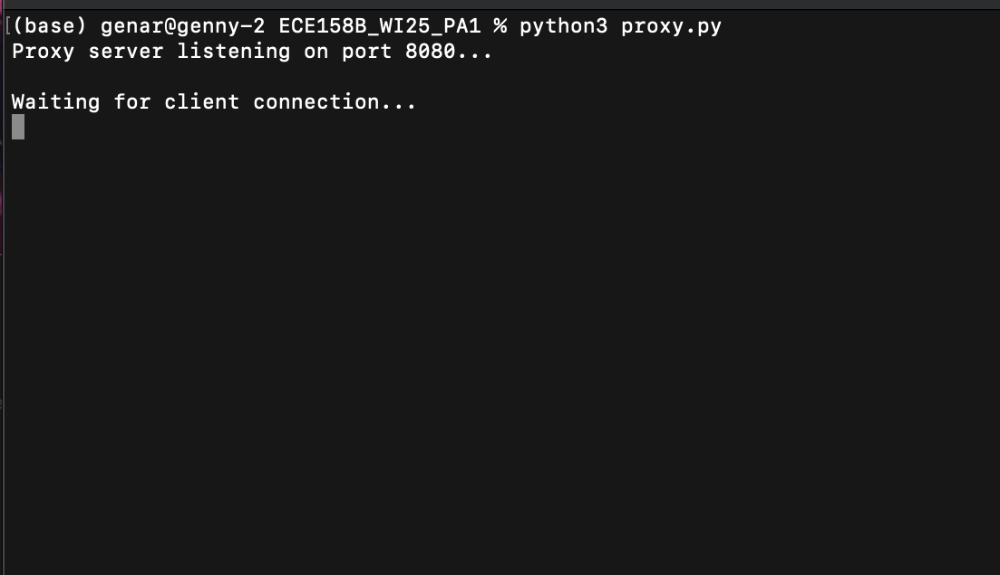
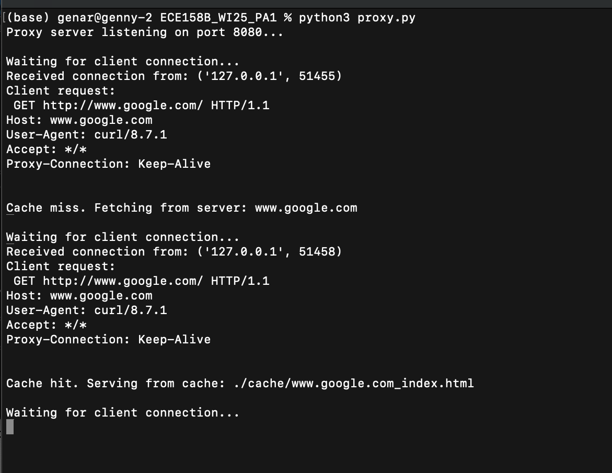
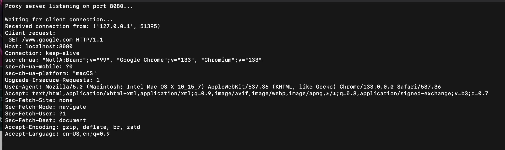
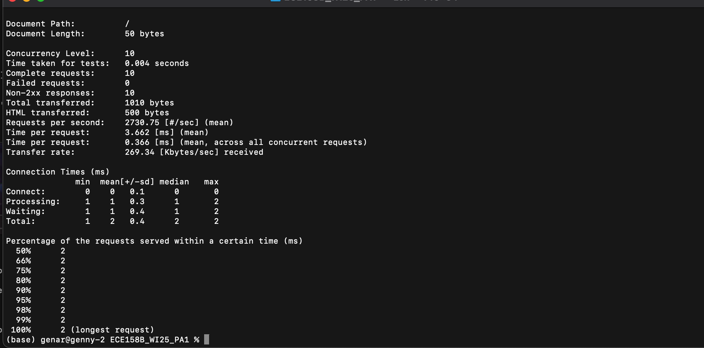

# Web Proxy Server Report

## Introduction
This report documents the implementation of a simple web proxy server that supports HTTP GET and POST methods, as well as basic web caching. The proxy server intercepts client requests, forwards them to the web server, caches responses, and serves cached data for repeated requests.

---

## Implementation

### Features Implemented
✅ **Basic Proxy Functionality**
   - Receives HTTP requests from clients.
   - Forwards the requests to the target web server.
   - Returns the response from the server to the client.

✅ **Support for HTTP POST**
   - Handles HTTP POST requests by forwarding the request body.

✅ **Web Caching**
   - Caches responses from the web server to serve repeated requests quickly.
   - Saves cached responses as files.
   - Fetches cached responses when available.

---

## Code Implementation
Below is the full implementation of the proxy server:

```python
from socket import *
import sys
import os

# Constants
MAX_BUF = 4096
HOST_NAME = 'localhost'  # Listen on all available interfaces
BIND_PORT = 8080  # Proxy server port
CACHE_DIR = "./cache/"  # Directory to store cached files

# Ensure cache directory exists
if not os.path.exists(CACHE_DIR):
    os.makedirs(CACHE_DIR, exist_ok=True)

# Create server socket
tcpSerSock = socket(AF_INET, SOCK_STREAM)
tcpSerSock.setsockopt(SOL_SOCKET, SO_REUSEADDR, 1)
tcpSerSock.bind((HOST_NAME, BIND_PORT))
tcpSerSock.listen(10)

print(f"Proxy server listening on port {BIND_PORT}...")

while True:
    print("\nWaiting for client connection...")
    tcpCliSock, addr = tcpSerSock.accept()
    print(f"Received connection from: {addr}")

    # Receive request from client
    message = tcpCliSock.recv(MAX_BUF).decode(errors='ignore')
    if not message:
        tcpCliSock.close()
        continue

    print("Client request:\n", message)

    # Extract URL from the request
    request_lines = message.split("\r\n")
    first_line = request_lines[0].split()
    
    if len(first_line) < 2:
        tcpCliSock.close()
        continue

    method = first_line[0]  # GET or POST
    url = first_line[1]  # Requested URL

    # Extract hostname and path
    if "://" in url:
        url = url.split("://", 1)[1]  # Remove http:// or https://

    hostn, _, path = url.partition("/")
    if not path:
        path = "index.html"  # Default to index.html if no specific file requested

    cache_file = os.path.join(CACHE_DIR, hostn.replace(":", "_") + "_" + path.replace("/", "_"))

    # Check if the file is already cached
    file_exist = os.path.exists(cache_file)

    if file_exist:
        print("Cache hit. Serving from cache:", cache_file)
        try:
            with open(cache_file, "rb") as f:
                cached_data = f.read()
                tcpCliSock.sendall(b"HTTP/1.0 200 OK\r\nContent-Type: text/html\r\n\r\n" + cached_data)
        except Exception as e:
            print("Error reading cache:", e)
            tcpCliSock.sendall(b"HTTP/1.0 500 Internal Server Error\r\nContent-Type: text/html\r\n\r\n")
    else:
        print("Cache miss. Fetching from server:", hostn)

        try:
            # Connect to the target server
            c = socket(AF_INET, SOCK_STREAM)
            c.connect((hostn, 80))

            # Create the request to forward
            full_request = f"{method} /{path} HTTP/1.0\r\nHost: {hostn}\r\n\r\n"
            c.sendall(full_request.encode())

            # Read server response and cache it
            with open(cache_file, "wb") as f:
                while True:
                    buffer = c.recv(MAX_BUF)
                    if not buffer:
                        break
                    f.write(buffer)  # Save response in cache
                    tcpCliSock.sendall(buffer)  # Forward response to client

            c.close()
        except Exception as e:
            print("Error fetching from server:", e)
            tcpCliSock.sendall(b"HTTP/1.0 404 Not Found\r\nContent-Type: text/html\r\n\r\n<html><body><h1>404 Not Found</h1></body></html>\r\n")

    tcpCliSock.close()
```

---

## Running the Proxy Server
### 🛠️ Steps to Run:
1. Start the proxy server using the following command:
   ```bash
   python proxy.py
   ```
2. Configure your web browser to use the proxy at `localhost:8080`.
3. Access web pages through the proxy (e.g., `http://localhost:8080/www.google.com`).

---

## Demonstration and Testing
### 📸 Screenshots
- Terminal output while the proxy is running.
 
      
- Successful cache hit.
 
      
- A fetched webpage through the proxy.
 

- Stress test of the size 10 backlog provided by Apache.



### 📹 Video Demonstration
- [ ] Upload a demo video to Google Drive or Dropbox and provide a link.

---

## Conclusion
This project successfully implements a basic web proxy with caching and POST support. Further enhancements could include:
✅ Implementing cache replacement policies
✅ Handling HTTPS requests
✅ Optimizing performance with multithreading

---

**📌 Author:** Philip Pincencia, Genaro Salazar Ruiz
**📅 Date:** February 14, 2025


